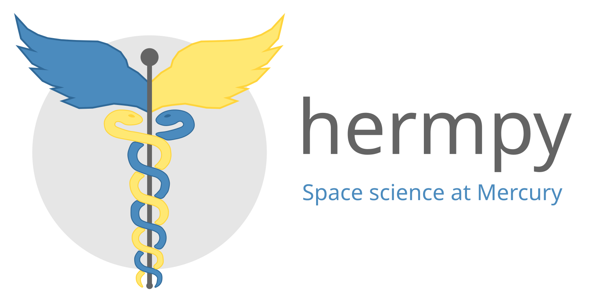

.. hermpy documentation master file, created by
   sphinx-quickstart on Fri May 29 23:39:21 2026.
   You can adapt this file completely to your liking, but it should at least
   contain the root `toctree` directive.

Introduction
------------

**Hermpy** is a small Python package designed to make space science a little
easier at Mercury. It is heavily opinionated, but I'm always open to new ideas,
suggestions, and contributions.

The name comes from the combination of Hermean (as in relating to Hermes, used
in relation to Mercury: 'Hermean environment') and Python.

Motivation
----------

This project began as a way for me to easily reuse code between projects during
my PhD. However, I've found I enjoy creating software, and continue to work on
it to explore ways to enable easier interaction with spacecraft data, ephemeris
(i.e. SPICE), and creating good looking figures.

Developing this project is primarily a hobby.

.. toctree::
   :maxdepth: 2
   :caption: Contents:

   getting_started
   generated_examples/index
